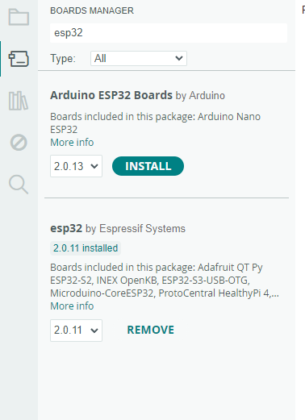

# 開發環境與設備
### 軟體
- Arduino IDE
### 板子
- [ESP32-WROVER(TYPE-C)](https://docs.espressif.com/projects/esp-idf/en/stable/esp32/hw-reference/esp32/get-started-devkitc.html)
- ESP8266(micro USB)

## Arduino IDE的設定
在file>Preferences>Addition board manager URL 貼上下面這兩行
```
https://arduino.esp8266.com/stable/package_esp8266com_index.json
https://dl.espressif.com/dl/package_esp32_index.json
```
在board manager下搜尋esp32 和 esp8266 並安裝


依照板子不同，在Tools>board選匹配的板子
##### ESP32選 ESP32 Dev Moudle

## 在Frizing的ESP32 moudle
- [點我下載電路圖](https://forum.fritzing.org/uploads/short-url/wRhnpBWV1IXNom3HWUSayiGnMjJ.fzpz)
<!-- 這是截自https://forum.fritzing.org/t/esp32-devkitc-v4-ready/17213/6 上的內容 -->